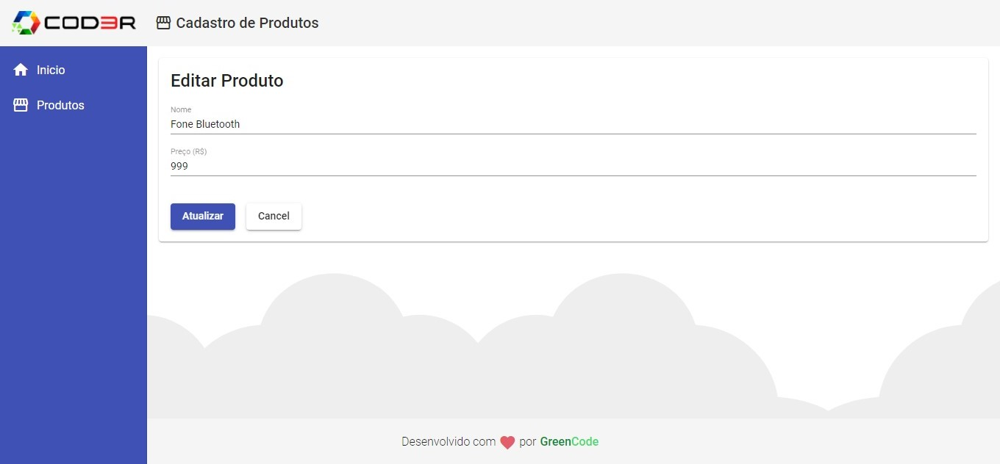

# Crud-Angular

# Como usar:

### Backend:

 Abra o projeto do backend 

 Use o `npm i` para instalar as dependencias.  

 Rode o `npm start` para rodar o servidor.  

### Frontend:

 Abra o projeto frontend 

 Use o `npm i` para instalar as dependencias. 

 Rode o  `ng serve --o` para rodar 

### O que foi usado:
> Angular,

> Material Desing,

> JsonServer,

> JavaScript,

# Imagens do projeto

